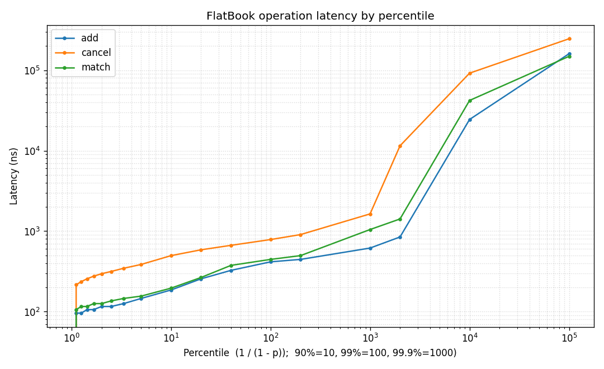

# limit-order-book

A low-latency **limit order book (LOB) and matching engine** written from scratch in
modern **C++20**. It implements price-time-priority matching with a cache-friendly,
zero-allocation hot path, a lock-free ingestion ring, and a microbenchmark harness that
reports per-operation latency (p50/p99/p99.9 in nanoseconds) and sustained throughput.

The same matching engine runs on two interchangeable backends:

* **`NaiveBook`** - an obviously-correct `std::map` + `std::list` reference implementation.
* **`FlatBook`** - an optimized backend using flat price-level arrays, intrusive FIFO
  lists, an object pool, and an open-addressing order index.

Having both lets every correctness test run against each backend, lets a differential
fuzz test prove they behave identically, and lets the benchmark quantify the speedup.

---

## Features

* **Order types:** limit, market, immediate-or-cancel (IOC), fill-or-kill (FOK).
* **Operations:** add, cancel, modify/replace (reduce-in-place keeps time priority;
  reprice/size-up re-queues).
* **Price-time priority** (FIFO within each price level), correct partial fills.
* **O(1) best-bid/offer (BBO)** queries.
* **Typed event stream:** `Accepted`, `Rejected`, `PartiallyFilled`, `Filled`, `Cancelled`.
* **Zero allocation on the hot path** (pre-allocated object pool + free list).
* **Lock-free SPSC ring buffer** for the order-ingestion path.
* Extensive **unit, property, and differential fuzz tests** (GoogleTest).

---

## Architecture

```
OrderRequest (id, side, type, price, quantity)
  |
  |  producer thread: feed or client
  v
+--------------------------+
|  SPSC ring (lock-free)   |
+--------------------------+
  |
  |  pop (consumer thread)
  v
+----------------------------------------------------------+
|                      MatchingEngine                      |
|  validate -> match on price-time priority -> rest        |
|  emits Accepted / Rejected / PartiallyFilled /           |
|         Filled / Cancelled                               |
+----------------------------------------------------------+
  |
  |  templated on the Book backend
  v
+----------------------------------------------------------+
|                       Book backend                       |
|                                                          |
|  FlatBook (optimized)         NaiveBook (reference)      |
|  +-------------------------+  +-----------------------+  |
|  | levels[] flat array     |  | std::map per side     |  |
|  |   idx = price - min     |  |   price -> std::list  |  |
|  | best_bid / best_ask     |  | best = map.begin()    |  |
|  |   cached as indices     |  |   O(log n) per access |  |
|  | intrusive FIFO list     |  | std::list per level   |  |
|  | ObjectPool<Order>       |  | unordered_map index   |  |
|  | FlatHashIndex           |  |   id -> list node     |  |
|  |   id -> pool slot       |  | unbounded price range |  |
|  +-------------------------+  +-----------------------+  |
+----------------------------------------------------------+
  |
  v
Event stream -> EventHandler sink
                (NullSink on the benchmark hot path)
```

### Components

| File | Responsibility |
|------|----------------|
| `include/lob/types.hpp` | Value types (`Price` ticks, `Quantity`, `OrderId`), `OrderRequest`, `Event`, reasons. |
| `include/lob/matching_engine.hpp` | Backend-agnostic price-time matching + event emission. |
| `include/lob/naive_book.hpp` | `std::map`/`std::list` reference backend. |
| `include/lob/order_book.hpp` | `FlatBook`: flat level array + cached BBO. |
| `include/lob/price_level.hpp` | `Order` node + intrusive FIFO `PriceLevel`. |
| `include/lob/object_pool.hpp` | Fixed-capacity pool with O(1) free list. |
| `include/lob/flat_hash.hpp` | Open-addressing `OrderId -> slot` index (backward-shift delete). |
| `include/lob/spsc_ring.hpp` | Lock-free single-producer/single-consumer ring buffer. |
| `include/lob/hdr_histogram.hpp` | From-scratch HdrHistogram for latency capture. |
| `include/lob/itch.hpp` / `itch_replayer.hpp` / `itch_writer.hpp` | NASDAQ ITCH 5.0 parser, book-reconstruction replayer, and message encoder. |

---

## Design decisions & tradeoffs

**Integer tick prices.** Prices are signed integer *ticks*, not floats. This removes
floating-point comparison hazards from matching and lets the optimized backend turn a
price into an array index with a single subtraction.

**Flat price-level array instead of `std::map`.** A red-black tree (`std::map`) costs a
pointer-chasing, cache-missing `O(log n)` traversal per access and allocates a node per
price level. `FlatBook` stores levels in one contiguous `std::vector` indexed by
`price - min_price`, so reaching a level is one indexed load. The tradeoff is a bounded,
pre-declared price band and memory proportional to the band width - exactly the model real
exchanges use (a symbol trades within a known tick range). Out-of-band limit prices are
rejected (`BookFull`).

**Cached BBO with lazy advance.** Best-bid/ask are cached as level indices, so BBO is
`O(1)`. When the best level empties, we scan toward the next occupied level. Because real
order flow clusters around the touch, this is `O(1)` amortized; the worst case (a single
order far from the rest) is the documented price for the flat layout.

**Intrusive FIFO lists + object pool.** Resting orders at a level form an intrusive
doubly-linked list whose nodes live in a pre-allocated `ObjectPool<Order>`. Add/cancel are
`O(1)` pointer splices, handles are 32-bit pool indices (smaller and more cache-dense than
pointers), and **no allocation happens on the hot path** - the pool hands out and recycles
slots from a free list.

**Open-addressing order index.** `OrderId -> pool slot` uses linear probing with
backward-shift deletion (no tombstones), sized once to keep the load factor below ~0.5.
This avoids the per-node allocation and pointer chasing of `std::unordered_map`.

**Lock-free SPSC ring.** The ingestion path is a bounded ring buffer using acquire/release
ordering (no locks, no CAS loops). `head`/`tail` sit on separate cache lines and each side
caches the other's index, so the steady state avoids false sharing and contended atomic
loads.

**One generic engine, two backends.** The matching logic is templated on the backend and
the event sink. This keeps behaviour identical across backends (enabling differential
testing) and lets the benchmark drop in a `NullSink` so it measures the engine, not the
observer.

---

## Benchmark results

Single-threaded, pinned core. Built with **g++ 13.2 (MinGW-W64)**, `-O3 -march=native`,
C++20. Latency measured with an x86 **TSC** timer (rdtsc), ~3.3 GHz, read overhead
subtracted. 1,000,000 operations per measurement. *Numbers vary run-to-run; the `max`
column reflects rare OS scheduling outliers (no real-time scheduling on Windows).*

### FlatBook (optimized) - per-operation latency

| operation | p50 (ns) | p99 (ns) | p99.9 (ns) | throughput |
|-----------|---------:|---------:|-----------:|-----------:|
| add       | ~115 | ~420 | ~950  | ~17 M ops/s |
| cancel    | ~250 | ~700 | ~1900 | ~10 M ops/s |
| match     | ~125 | ~450 | ~1100 | ~13 M ops/s |

### Optimized vs naive `std::map` (throughput speedup)

| operation | FlatBook | NaiveBook | speedup |
|-----------|---------:|----------:|--------:|
| add       | ~17 M/s | ~3.3 M/s | **~5x**  |
| cancel    | ~10 M/s | ~0.9 M/s | **~11x** |
| match     | ~13 M/s | ~5.9 M/s | **~2x**  |

The tail is where the flat design shines most: the naive book's add p99.9 is tens of
microseconds (tree rebalancing + node allocation), versus sub-microsecond for `FlatBook`.

### SPSC ingestion pipeline

End-to-end producer -> ring -> consumer/engine: **~45 M orders/s** with alternating
immediately-matching IOC orders.

### Latency by percentile (HdrHistogram)

The benchmark records every operation into a from-scratch **HdrHistogram** and exports a
latency-by-percentile spectrum to `bench/results/hdr_*.csv`. `scripts/plot_latency.py`
renders it:



The flat median (~115 ns add / ~125 ns match) holds until ~p99.9; the steep rise past
p99.99 is OS scheduling jitter, not the engine.

### NASDAQ ITCH 5.0 reconstruction

An ITCH 5.0 parser (`include/lob/itch.hpp`) decodes the length-prefixed BinaryFILE feed
and a replayer reconstructs the displayable book by applying add/execute/cancel/delete/
replace messages directly to a `FlatBook`. The official NASDAQ sample feeds are
multi-gigabyte, so `itch_gen` produces a spec-faithful synthetic stream to exercise the
pipeline end-to-end:

```
./build/itch/itch_gen   data/synthetic.itch 5000000   # ~160 MB, 5M messages
./build/itch/itch_replay data/synthetic.itch
```

Reconstruction throughput: **~7 M messages/s (~220 MB/s)**, single-threaded. To run a real
feed, download a NASDAQ ITCH 5.0 sample, `gunzip` it, and pass the path to `itch_replay`.
*(ITCH prices are scaled to cents to fit the flat tick band - the same band tradeoff
described above. The synthetic feed places orders at random prices, so its reconstructed
book may be crossed; real post-match feeds are not.)*

Reproduce the microbenchmarks with:

```
cmake --build build --target bench_main
./build/bench/bench_main      # Windows: .\build\bench\bench_main.exe
```

---

## Build & run

Requires CMake >= 3.20, Ninja, and a C++20 compiler. GoogleTest is fetched automatically.

```bash
# Configure (Release: -O3 -march=native)
cmake -S . -B build -G Ninja -DCMAKE_BUILD_TYPE=Release

# Build everything
cmake --build build

# Run the tests
ctest --test-dir build --output-on-failure

# Run the benchmarks
./build/bench/bench_main
```

Debug build:

```bash
cmake -S . -B build-debug -G Ninja -DCMAKE_BUILD_TYPE=Debug
cmake --build build-debug
```

Options: `-DLOB_NATIVE_ARCH=OFF` disables `-march=native`; `-DLOB_BUILD_TESTS=OFF` /
`-DLOB_BUILD_BENCH=OFF` skip those targets.

---

## Testing

| Suite | What it covers |
|-------|----------------|
| `matching_test` | Matching correctness, partial fills, price-time priority, all order types, modify/cancel, validation, crossed-book/self-cross, empty book. **Runs against both backends** via typed tests. |
| `structures_test` | `ObjectPool`, `FlatHashIndex` (incl. collision/delete stress), intrusive `PriceLevel`. |
| `property_test` | **Differential** test: naive and flat emit byte-identical event streams over thousands of random ops across many seeds. **Invariants:** book never crossed, quantity conservation. |
| `spsc_test` | Ring buffer single-thread semantics + a concurrent producer/consumer delivering 1M items in order. |
| `hdr_test` | HdrHistogram correctness: counts, `for_each`, and percentiles within HDR precision of a sorted reference. |
| `itch_test` | ITCH 5.0 round-trip: encode a stream, parse + replay it, and verify the reconstructed book (BBO, sizes, quantities) and out-of-band skipping. |

---

## What I learned

* **Data-structure choice dominates.** Swapping `std::map`/`std::unordered_map` for flat
  arrays, intrusive lists, an object pool, and an open-addressing index produced ~5-11x
  throughput gains and an order-of-magnitude better tail latency - without changing the
  matching algorithm at all.
* **The tail tells the truth.** Average throughput hid the real story; the naive book's
  p99.9 blew up from allocation and tree rebalancing. Measuring p99/p99.9 (not just the
  mean) is essential for anything latency-sensitive.
* **Measure the clock, not just the code.** `steady_clock` here has ~100 ns granularity,
  which silently quantized every latency sample. Switching to a calibrated TSC timer (and
  subtracting the read overhead) was necessary to get meaningful nanosecond numbers.
* **Templating the engine over the backend** turned correctness into a free differential
  test and kept the benchmark honest (identical logic, swappable storage).
* **Mechanical sympathy in the ring buffer** - cache-line separation of head/tail and
  caching the peer index - matters a lot for SPSC throughput.

---

## Roadmap (stretch goals)

- [x] **NASDAQ ITCH 5.0 parser**: decodes the feed and reconstructs the book at
      ~7 M msgs/s (`include/lob/itch*.hpp`, `itch/`). Synthetic generator included; points
      at the real sample feed too.
- [x] **HdrHistogram + plots**: latency histograms with a percentile-spectrum chart
      (`include/lob/hdr_histogram.hpp`, `scripts/plot_latency.py`).
- [x] **Naive vs optimized comparison benchmark** (implemented; see results above).
